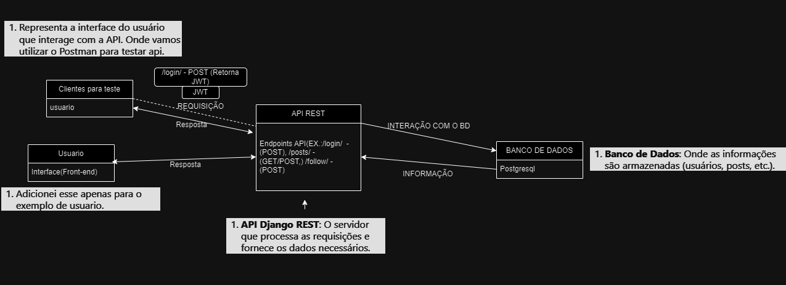

# MINI-TWITTER: (IMPLEMENTAÇÃO DE UMA API REST) 

## RESUMO PRÉVIO
* Uma API para uma plataforma de rede social como exemplo o twitter,construída com Django e Django REST Framework, onde os usuários podem se registrar, criar e curtir postagens, seguir uns aos outros e visualizar um feed paginado das postagens dos usuários que seguem.

## Funcionalidades 
- **Cadastro de Usuários**: Registro de novos usuários.
- **Login com JWT**: Autenticação com tokens de acesso e atualização.
- **Publicação de Postagens**: Criação, listagem e visualização de postagens.
- **Feed Personalizado**: Exibe postagens dos usuários seguidos.
- **Seguir/Deixar de Seguir**: Usuários podem seguir ou deixar de seguir outros.
- **Curtir Postagens**: Curtir ou remover curtidas em publicações.

## Tecnologias Utilizadas 
- **Python 3.8+**
- **Django 4.x**
- **Django REST Framework**
- **Simple JWT (para autenticação com tokens)**


# COMO EXECUTAR O PROJETO 
### PRÉ-REQUESITOS
- Python 3.x instalado
- Virtualenv instalado (opcional, mas recomendado)
+ Banco de dados PostgreSQL configurado
    - Nome do banco: 
    - Usuário: 
    - Senha: 
    - Host: 
    - Porta:


## Passo a Passo para Configuração da Aplicação

Siga os passos abaixo para configurar e executar a aplicação Django.

### 1. Clone o Repositório

Clone o repositório para sua máquina local:

```bash
git clone https://github.com/DavydKennyd/mini-twitter.git
cd mini-twitter
```
### 2. Crie um Ambiente Virtual
É recomendável criar um ambiente virtual para gerenciar as dependências do projeto:

```bash
Copiar código
python -m venv venv
source venv/bin/activate  # Para Linux/Mac
venv\Scripts\activate     # Para Windows
```
### 3. Instale as Dependências
Instale as dependências necessárias usando o arquivo requirements.txt:

```bash

pip install -r requirements.txt
```
### 4. Crie o Banco de Dados
Acesse o console do PostgreSQL e crie um novo banco de dados:

```bash

psql -U postgres
CREATE DATABASE mini_twitter;
\q
```
### 5. Configure as Configurações do Banco de Dados
Abra o arquivo settings.py e configure as credenciais do banco de dados:
```bash

DATABASES = {
    'default': {
        'ENGINE': 'django.db.backends.postgresql',
        'NAME': 'mini_twitter',
        'USER': 'postgres',  # ou seu_usuario se você criou um novo usuário
        'PASSWORD': '12345', # ou a senha do seu novo usuário
        'HOST': 'localhost',
        'PORT': '5432',
    }
}
```
### 6. Aplique as Migrações
Aplique as migrações do Django para criar as tabelas necessárias no banco de dados:
```bash
python manage.py makemigrations

python manage.py migrate
```

### 7. Execute o Servidor 

```bash
python manage.py runserver
```

## Exemplo de Tabela de Endpoints da API

## Endpoints da API
- Nos EndPoints lembre-se sempre de adicionar /api antes dos Enpoint que estão abaixo. Exemplo: **http://127.0.0.1:8000/api/register/**

| Método | Endpoint                     | Descrição                                    |
|--------|------------------------------|----------------------------------------------|
| POST   | /register/                   | Cadastrar um novo usuário                    |
| POST   | /login/                      | Realizar login e obter tokens de acesso      |
| GET    | /feed/                       | Obter o feed de postagens dos usuários seguidos |
| POST   | /follow/<int:user_id>/       | Seguir um usuário                            |
| DELETE | /unfollow/<int:user_id>/     | Deixar de seguir um usuário                  |
| POST   | /posts/                      | Criar uma nova postagem                       |
| GET    | /posts/                      | Listar todas as postagens                    |
| GET    | /posts/<int:post_id>/        | Obter detalhes de uma postagem específica     |
| POST   | /posts/<int:post_id>/like/   | Curtir uma postagem                           |


### EXEMPLOS DE REQUESIÇÕES
#### 1.Registro de Usuários
- **/api/register/**:  
  - Método: `POST`  
  - Payload:  
    ```json
    {
      "username": "seu_username",
      "email": "seu_email@example.com",
      "password": "sua_senha"
    }
    ```
### 2. Login
- **/api/login/**:  
  - Método: `POST`  
  - Payload:  
    ```json
    {
      "username": "seu_username",
      "password": "sua_senha"
    }
    ```
### 3. Visualiza feed dos seguidos 
- **/feed/**:  
  - Método: `GET`  
  - Retorna: Uma lista de postagens dos usuários que você está seguindo.
### 4. Seguir
- **/follow/<int:user_id>/**:  
  - Método: `POST`  
  - Descrição: Segue um usuário específico.
### 5. Parar de seguir
- **/api/unfollow/<int:user_id>/**:  
  - Método: `DELETE`  
  - Descrição: Deixa de seguir um usuário específico.
### 6. Faz uma postagem 
- **/api/posts/**:  
  - Método: `POST` e `GET`  
  - `POST`: Cria uma nova postagem.  
  - `GET`: Lista todas as postagens.
### 7. Busca publicação específica
- **/api/posts/<int:post_id>/**:  
  - Método: `GET`  
  - Descrição: Obter detalhes de uma postagem específica.
### 8. Curti uma postagem
- **/api/posts/<int:post_id>/like/**:  
  - Método: `POST`  
  - Descrição: Curtir uma postagem específica.


## Autenticação
A API utiliza JWT (JSON Web Tokens) para autenticação. Ao fazer login, o usuário receberá dois tokens:

- Access Token: Para acessar endpoints autenticados.
- Refresh Token: Para obter novos access tokens.

### Exemplo de Autenticação
Adicione o token no cabeçalho da requisição:

```BASH
Authorization: Bearer <seu_access_token>
``` 

## Testando no Postman
Siga as instruções abaixo para testar os endpoints da API usando o Postman, vou utilizar o método de registrar um usuário(Onde os outros seguem a mesma lógica):

### Registro de Usuário
- Método: POST
- URL: http://127.0.0.1:8000/api/register/
- Após adicionar a URL, aperte em params(Parâmetros) e selecione body, em seguida aperta em "raw" e seleciona JSON(Como padrão do postman vai ta em "Text", então muda para JSON).
- E em seguida no body adiciona:
```BASH
{
  "username": "seu_usuario",
  "email": "usuario@example.com",
  "password": "sua_senha"
}

```
### Login de Usuário
- Método: POST
- URL: http://127.0.0.1:8000/api/login/
- Após adicionar a URL, aperte em params(Parâmetros) e selecione body, em seguida aperta em "raw" e seleciona JSON(Como padrão do postman vai ta em "Text", então muda para JSON).
- Após isso adiciona Body (onde você adiciona o script).:
```BASH
{
  {
    "username": "seu_usuario",
    "password": "sua_senha"
}
}
```
- Após logar você irá receber um token (chave de acesso), o qual você vai utilizar para realizar as ações na API. Qunado fizer o login a resposta esperada vai ser a seguinte: 

```bash
{
    "refresh": "TOKEN REFRESH",
    "access": " <TOKEN DE ACESSO (JWT)> "
}
```
## Criar Postagem
- Método: POST
- URL: http://127.0.0.1:8000/api/posts/
- Logo após você fazer seu login e pegar seu Token de acesso você irá fazer os seguintes passo: Depois de ter adicionado a URL, aperte em params(Parâmetros) e selecione Headers, no "key" adicione "Authorization" e em "Value" e adicione "Bearer < Token de acesso >" nessa parte de token você adiciona a chave de acesso que JWT te fornece logo após fazer login. Em seguida, seleciona body (no mesmo local onde você selecionou headers, dessa vez irá selecionar "body"), seleciona "raw" e "JSON" e no script adicina a sintaxe:

```bash
{
    "text": "Postagem do documento",
    "image": null
}
```
- A resposta esperada é essa:
```bash 
{
    "id": 3,
    "author": 3,
    "text": "Postagem do documento",
    "image": null,
    "created_at": "2024-10-25T16:50:10.135409Z",
    "likes_count": 0
}
```
## Seguir e parar de seguir
+ Para seguir outro usuário
  - Método: POST
  - URL: http://127.0.0.1:8000/api/follow/id_do_user/
  - Aqui você vai seguir os seguintes passos, irá fazer o login, pegar o token e  selecionar Headers, no "key" adicione "Authorization" e em "Value" e adicione "Bearer < Token de acesso >". Exemplo abaixo:
```bash
http://127.0.0.1:8000/api/follow/4/ #4 seria o id da pessoa que quero seguir
#APÓS TER ADICIONADO O KEY E O VALUE PRESSIONE "SEND"
```
- A resposta esperada é essa:
```bash
{
    "detail": "Agora você está seguindo"
}
```
  + Para parar de seguir:
    - Método: DELETE
    - URL: http://127.0.0.1:8000/api/unfollow/id_do_user/
    - Aqui você irá fazer os passos para os mesmos passos para seguir, apenas mudará o endPoints para unfollow.
```bash
http://127.0.0.1:8000/api/unfollow/4/ # o numero 4 é o id do user que quero parar de seguir  
```
- Resposta esperada:
```bash
{
    "detail": "Você deixou de seguir"
}
```
## Visualizar feed (Apenas de quem você segue)
- Método: GET
- URL: http://127.0.0.1:8000/api/feed/
- Nesse endpoint você irá visualizar todos os posts dos usuários que você segue, basta apenas repitir os mesmos passos anteriores, faz login pega o token e  selecionar Headers, no "key" adicione "Authorization" e em "Value" e adicione "Bearer < Token de acesso >", e pressiona "send".
- A resposta esperada é essa:
```bash
{
    "count": 1,
    "next": null,
    "previous": null,
    "results": [
        {
            "id": 2,
            "author": 4,
            "text": "Meu post",
            "image": null,
            "created_at": "2024-10-24T19:44:29.344422Z",
            "likes_count": 0
        }
    ]
}
```
## Curtir uma postagem
- Método: POST
- URL: http://127.0.0.1:8000/api/posts/id_do_post/like/
- Nesse endpoit você irá pegar o id do post, se voltar no tópico "Visualizar feed" vai perceber que a postagem tem um id, será esse id que você irá adicionar o endpoint, ou seja, no link. E novamente, mesmo passos dos tópicos anteriores, pega o token e  selecionar Headers, no "key" adicione "Authorization" e em "Value" e adicione "Bearer < Token de acesso >", e pressiona "send".
- Exemplo de usar: 
```bash
  http://127.0.0.1:8000/api/posts/2/like/ #2 é o id do post.
```
- Resposta esperada:
```bash
{
    "detail": "Postagem curtida"
}
```
## Imagens com Diagramas de arquitetura e ERD.

- Diagrama de Arquitetura



- Diagrama de ERD
.png)

- Para ver com mais detalhe as imagens basta entrar no diretório /imagens_diagramas.

## Conclusão
Este projeto demonstra a implementação de uma API REST simples para uma plataforma de rede social utilizando Django e Django REST Framework. Esperamos que, ao seguir este guia, você consiga configurar e testar todos os endpoints corretamente.

Sinta-se à vontade para contribuir com sugestões ou melhorias através de Pull Requests no repositório. Qualquer dúvida ou problema encontrado durante a execução, não hesite em abrir uma Issue.

## Contato
Em caso de dúvidas ou sugestões, entre em contato:

E-mail: kennyd3030@gmail.com
